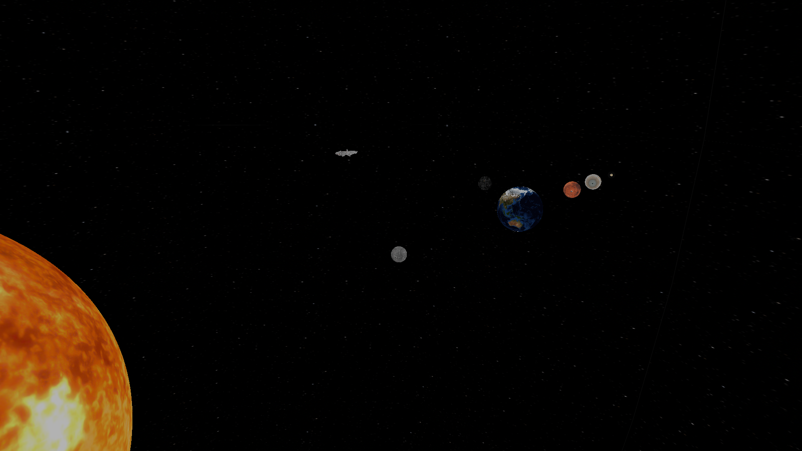
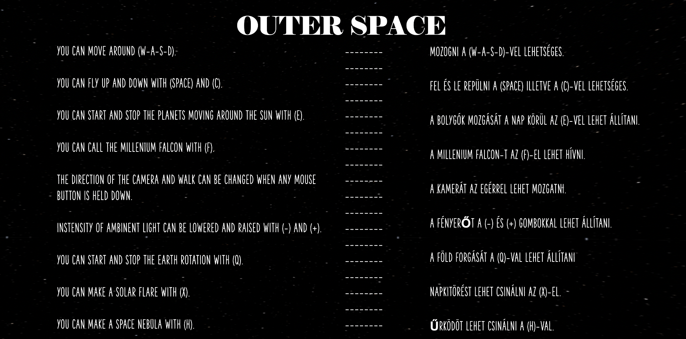
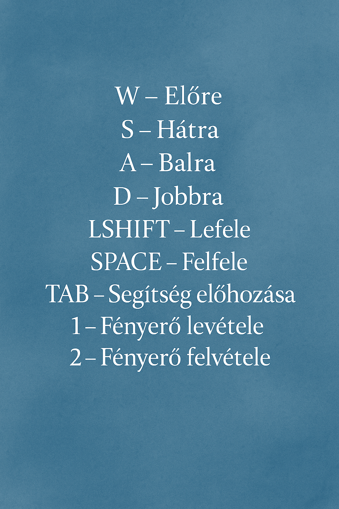

# Outer Space - Naprendszer szimuláció & Sillyworld - Faház szimuláció
---
# Outer Space - Naprendszer szimuláció
Ez a projekt egy egyszerű **Naprendszer szimuláció**, amelyben bolygók mozognak a Nap körül, a kamera szabadon irányítható, és különböző látványos effektek is aktiválhatók.

---

---

## 📁 Projekt Felépítés

📁 c_sdk_220203

    📁 examples
        └── ...
    📁 MinGW
        └── ...
    📁 Notepad++
        └── ...
    📄 shell.bat
    📁 beadando
        📁 assets
            📁 models
                📄 deathstar.obj
                📄 falcon.obj
                📄 geoid.obj
                📄 jupiter.obj
                📄 mars.obj
                📄 mercury.obj
                📄 saturn.obj
            📁 textures
                📄 deathstar.png
                📄 earth.png
                📄 falcon.png
                📄 help.png
                📄 jupiter.png
                📄 mercury.png
                📄 saturnbody.png
                📄 sky.png
                📄 sun.png
        📁 include
            📄 camera.h
            📄 draw.h
            📄 model.h
        📁 src
            📄 camera.c
            📄 draw.c
            📄 model.c
            📄 main.c
        📄 beadando.exe
        📄 glut32.dll
        📄 libfreeglut.dll
        📄 SOIL.dll
        📄 Makefile

**freeglut-3.6.0 mappa:** (ha újrafordításra van szükség) A **make** parancs használatához szükséges ennek a mappának a tartalma! A make file ezt a mappát is meghívja **(desktop/freeglut-3.6.0)** mert szükség van mappában lévő könyvtárakra.

---

## 🌟 Látványos effektek a szimulációban

**A projekt során az alábbi látványos grafikai elemek kerültek beépítésre:**

🌍 Föld forgásának megállítása

- Egy gombnyomásra leállítható a Föld tengely körüli forgása, demonstrálva a mozgások kontrollálhatóságát.

☀️ Napkitörés 

- A Nap felszínéről gombnyomásra látványos részecske-effekt jelenik meg, imitálva a szoláris kitöréseket.

🌫️ Űrköd effekt

- Gombnyomásra, áttetsző köd jelenik meg, ami mélységérzetet és realisztikusabb űrbéli látványt biztosít.

🚀 Beúszó űrhajó animáció (gombnyomásra)

- Egy interaktív elemként, gombnyomásra egy űrhajó animáltan beúszik a képernyőre, majd eltűnik.

🔁 Bolygók keringésének indítása/leállítása

- Interaktív vezérlés gombbal: a bolygók keringése a Nap körül elindítható vagy megállítható.

---

## 🕹️ Irányítások

- **W-A-S-D**: Mozgás előre, balra, hátra, jobbra.
- **Space / C**: Fel és le mozgás.
- **Egér**: Kamera forgatása (egérgomb nyomva tartásával).
- **E**: Bolygók mozgásának elindítása/leállítása.
- **F**: Millennium Falcon megjelenítése.
- **- / +**: Környezeti fényerő csökkentése/növelése.
- **Q**: Föld forgásának elindítása/leállítása.
- **X**: Napkitörés (solar flare) létrehozása.
- **H**: Űrköd (space nebula) létrehozása.

- **F1**: A használati útmutató megjelenítése a programban.

---

## ✨ Főbb funkciók

- Bolygók Kepler-törvények szerinti mozgása.
- Kamera szabad mozgása billentyűzettel és egérrel.
- Millennium Falcon különleges eseményként megjeleníthető.
- Dinamikus fényerő szabályozás.
- Napkitörés effekt (részecskerendszer).
- Űrköd (space nebula) generálás.
- Textúrázott modellek (Föld, Jupiter stb.).

---

## 🛠️ Fejlesztőkörnyezet & használt könyvtárak

- Visual Studio Code (C programozás) [VSCode](https://code.visualstudio.com)
- [Letöltési link a szükséges könyvtárakhoz (c_sdk_220203)](https://web.uni-miskolc.hu/~matip/grafika/pages/development.html)
- A projekthez szükséges volt még letölteni a freeglutot illetve futtatni bashből, hogy létrejöjjön a .dll fájl, illetve másolni a hozzá tartozó könyvátrakat (lib).
[freeglut](https://www.transmissionzero.co.uk/software/freeglut-devel/)
- A Simple OpenGL Image Library (SOIL) telepítésére is szükség volt (SOIL.dll)
[SOIL](https://github.com/littlstar/soil)
- A GLUT-ot is (glut32.dll) szükséges volt implementálni.
[GLUT32](https://github.com/kripken/bullet/blob/master/Glut/glut32.lib)

---

## 📚 Források

**Textúrák:**
- [ambientCG (CC0 Textures)](https://ambientcg.com/)
- [Textures.com](https://www.textures.com/)
- [Poly Haven Textures](https://polyhaven.com/textures)

**3D modellek:**
- [Poly Haven Models](https://polyhaven.com/models)
- [Sketchfab (Free Models)](https://sketchfab.com/search?features=downloadable&sort_by=-likeCount&type=models)
- [Free3D](https://free3d.com/)
- [CGTrader (Free Models)](https://www.cgtrader.com/free-3d-models)

---

# Sillyworld - Faház szimuláció

Ez a projekt **most készült el**, célom, hogy a tantárgyból **megszerezzem az aláírást**.

---
## 📌 Projektleírás

A beadandó feladatra egy egyedi szimulációs környezetet választottam:  
egy **faházat egy elhagyatott mezőn**, amelyet a felhasználó **kívülről körbejárhat**.

A szimuláció tartalmaz:
- Egy **tavat** a ház mellett
- Egy **Velociraptort** és egy **nyulat**, amelyek folyamatosan mozognak
- Egy **kandallót** a ház belsejében, amely **fahiány miatt nem működik**

A jelenet célja egy nyugodt, mégis izgalmas, mozgó világ megjelenítése különféle elemekkel.

---

## 🎮 Irányítás

A játékvezérlés egyszerű és intuitív. A **TAB** billentyű lenyomásával megjelenik egy **GUIDE menü**, amely részletesen ismerteti az alapvető irányítási lehetőségeket.

---

---

## 💡 További fejlesztési lehetőségek

- Interaktívabb környezet (pl. tüzet lehet rakni a kandallóban, ha fát találunk)
- Dinamikus időjárás
- Belépés a faház belsejébe

---
